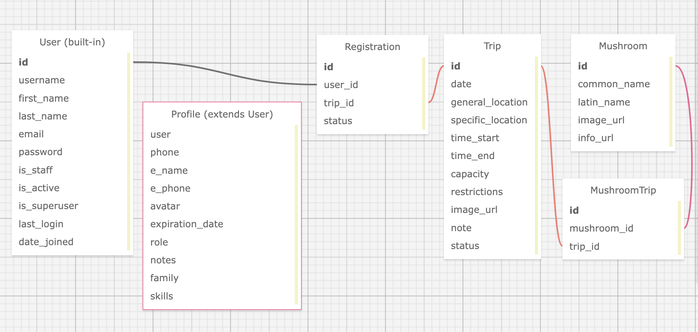

# Capstone Proposal and MVP 
### by [Kim Robinson](https://github.com/kimmykokonut)

---------------------------
### Jump around!
* <a href="#about-the-project">About the Project</a>
* <a href="#description">Description</a>
* <a href="#built-with">Built With</a>
* <a href="#known-bugs">Known Bugs</a>
* <a href="#getting-started">Getting Started</a>
* <a href="#prerequisites">Prerequisites</a>
* <a href="#setup">Setup</a>
* <a href="#api-documentation">API Documention</a>
* <a href="#setup-client-side">Setup Client Side</a>
* <a href="#stretch-goals">Stretch Goals</a>
* <a href="#license">License</a>
* <a href="#acknowledgements">Acknowledgements</a>
---------------------------
### About the Project

### Description
describe here

### Built With
python, django, react, typescript

### Known Bugs
* None at this time.

Please [report](https://github.com/kimmykokonut/Capstone/issues) any issues or bugs 


### Getting Started

### Prerequisites

### Setup


notes:
Install Homebrew `/bin/bash -c "$(curl -fsSL https://raw.githubusercontent.com/Homebrew/install/HEAD/install.sh)"`

Install python 3 `$ brew install python@3`
download python.
clone project

create virtual env
`$ python3 -m venv .venv`

enter virtual env
`$ . .venv/bin/activate`

install dependencies
`$ pip install -r requirements.txt
run server (http://127.0.0.1:8000/)
`$ python manage.py runserver`

to exit virtual env
`$ . deactivate`

setupadmin?

#### Database




### API Documention

```
/signup (post)
/login (post)
/logout (post)
/profile (get, put)-permission to authenticated user, coordinator and admin
/mushrooms (get, post)-all members. (put/delete in rest admin)
/trips (get-all members, post-admin/coordinator)
/trips/{id} (get-all members, put-admin/coordinator, delete-admin/coordinator)
/trips/{id}/register (post-user registers for trip, their token is their id)
/trips/{id}/results (get-get results of lottery and users' status on trip) 
```

### Setup Client Side
- This is a React App scaffolded with Vite using Typescript
- cd into client
- in terminal: 
  ```
  npm install
  npm run dev  
  ```
Local server will be at  `http://localhost:5173/`

### Stretch Goals

- there might be a bug if there is more than 1 coordinator in database for auto-email
- 100% line coverage for testing.  Haven't tested the actual lottery data because it is random-but testing passes for the right number of people chosen per category.
- make lottery weighted. might need more dummy users and more trips to test.
- integrate weather api for weather report on trip page by date of trip
- add leaflet map component (ranger stations? trip locations?)
- data vis for ? # people applied on trips over time...
- google sign in functionality

### Notes to self
- Security of my sender email if deployed?
- update views to all be class or functional for consistency
- should test.rest be in git or not?
- need to add listener for trip lottery to happen on reg_close date (right now an endpoint which will be a button for testing.)
- make pw stricter but not during testing
- better security: https at deploy
- in deploy: change views-login&signup: secure=False to TRUE once in https

### License
GNU, see license.md for more information

### Acknowledgements
-----------------------------