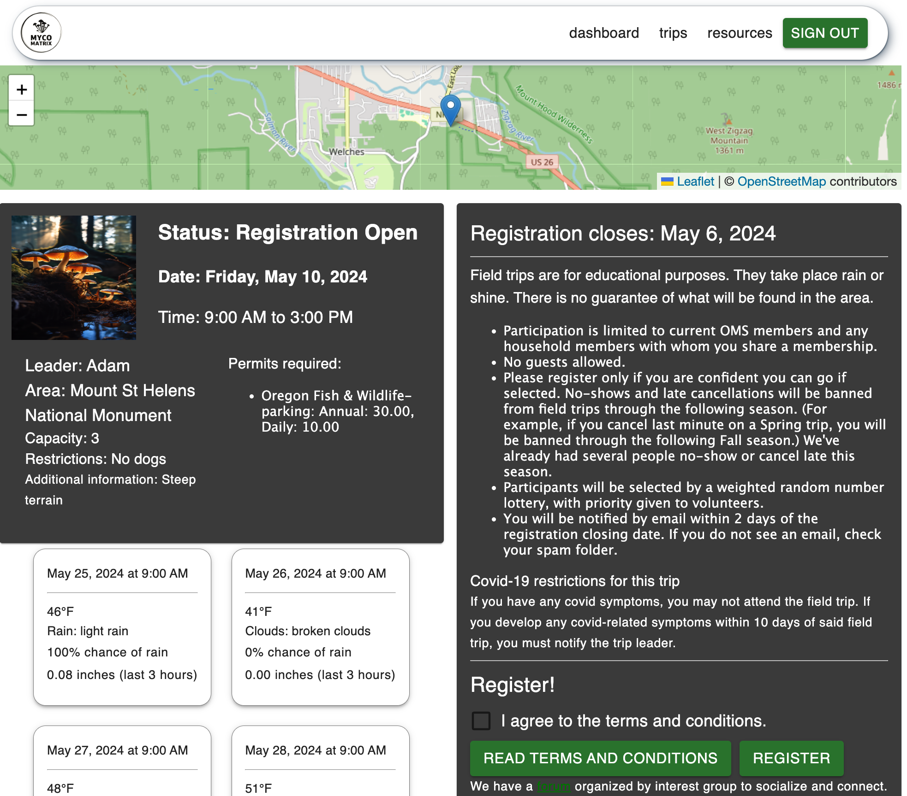

<center>
  <h1>Myco Matrix</h1>
  <h3>by <a href="https://github.com/kimmykokonut">Kim Robinson</a></h3>
  <p align="center">
        <a href="https://github.com/kimmykokonut/Capstone/stargazers">
            
        </a>
        ¨
        <a href="https://github.com/kimmykokonut/Capstone/issues">
            
        </a>
        ¨
        <a href="https://github.com/kimmykokonut/Capstone/blob/main/LICENSE">
            
        </a>
        ¨
        <a href="https://www.linkedin.com/in/robinson-kim/">
            
        </a>
    </p>    
</p>
  <a href="https://myco.onrender.com/" alt="hosted site">See it live on Render</a>
  <p>Initiated April 15, 2024</p>
  </center>

<div style="display: flex; justify-content: space-around;">
  <div style="width: 40%;">
  
  </div>
    <div style="width: 40%;">
  
  </div>
  </div>

---------------------------
### Jump around!
* <a href="#about-the-project">About the Project</a>
  * <a href="#description">Description</a>
  * <a href="#built-with">Built With</a>
  * <a href="#known-bugs">Known Bugs</a>
* <a href="#getting-started">Getting Started</a>
  * <a href="#prerequisites">Prerequisites</a>
  * <a href="#setup">Setup</a>
* <a href="/client/README.md">Readme - Client Side (User experience previews and documentation)</a>
* <a href="/api/README.md">Readme - Backend API (User authentication, API Endpoints, Django Admin)</a>
* <a href="#miscellaneous">Miscellaneous</a>
  * <a href="#contact-and-support">Contact and Support</a>
  * <a href="#license">License</a>
  * <a href="#acknowledgements">Acknowledgements</a>
  * <a href="#stretch-goals-and-thoughts">Stretch Goals and Thoughts</a>
---------------------------
## About the Project

### Description

  Myco Matrix is an application where users can register for field trip lotteries, connect with other members and access resources to ensure their foraging experience is safe and permitted.

  The Myco Matrix allows users to register and sign in to their own account as well as edit their profile information, register for upcoming field trips and access resources such as packing lists and parking and foraging permits needed by location.  Administrators and users within the Coordinator group can create, edit and delete field trips and manually run the lottery, which randomizes registrants and assigns them their trip status (accepted, waitlisted, rejected).  The automated lottery function emails the registrants their status once the lottery is complete and emails the trip leader the group's contact information.  Stretch goals include incorporating the existing mushroom information in the database to attach mushrooms seen on field trips and have that data visible, as well as a functional comment thread on each field trip, for users to connect with other users. (More stretch goals at bottom).

  This project was inspired by my years spent as the volunteer field trip coordinator for the [Oregon Mycological Society](https://www.wildmushrooms.org/).  I have a strong desire to streamline and automate the process while freeing up volunteer time for other efforts. My long-term goal is to integrate this project into their website to be used for future field trips and provide archival knowledge and encourage more member connection and community.

### Built With
* [React Leaflet](https://react-leaflet.js.org/) 
* [OpenWeather API](https://openweathermap.org/api)


### Known Bugs 
* `POST /trips/10/register HTTP/1.1" 400` Once a user registers for a trip, the page disables the register button and lets then know they have registered for the trip.  If they navigate away from the page and back, it is the same.  If they refresh the page /trips/{id} right after they register, they are offered the registration button again and can sign up for the trip.  I have error handling in the api endpoint that won't allow the user to register twice and in react, an error message has been created to address this error. (if the user leaves the page and comes back, it is functional.)
* MushroomList: issue displaying image-console log says the cookie will expire. The issue is not related to storing the URLs, but to the same-origin policy of the browser, which restricts how resources loaded from different origins can interact.  Look into GoogleCloud Storage and django-storages library
* Issue with state updating: after lottery closes, can navigate to dashboard but trip status is not updated unless I refresh the page, then it is fine.
* Chrome console warning: Reading cookie in cross-site context will be blocked in future Chrome versions. Once deployed in https, try: cookie = "name=value; SameSite=None; Secure";  (currently: response.set_cookie('auth_token', token.key, httponly=True, samesite='None', secure=True))

Please [report](https://github.com/kimmykokonut/Capstone/issues) any issues or bugs 

---

## Getting Started

### Prerequisites

### Code Editor
  To view or edit the code, you will need a code editor or text editor. The open-source code editor we used is VisualStudio Code.

  1) Code Editor Download: [VisualStudio Code](https://www.npmjs.com/)
  2) Click the download most applicable to your OS and system.
  3) Wait for download to complete, then install -- Windows will run the setup exe and macOS will drag and drop into applications.

### Install RestClient Extension for Visual Studio Code
(Optional) Download and install VS Code [RestClient extension](https://marketplace.visualstudio.com/items?itemName=humao.rest-client)

### Install Postman
(Optional) Download and install [Postman] to test API calls(https://www.postman.com/downloads/).

### Install Homebrew (macOS)
_I highly recommend you download this package manager to install software._

In terminal:
`/bin/bash -c "$(curl -fsSL https://raw.githubusercontent.com/Homebrew/install/HEAD/install.sh)"`

### Install Python via homebrew
In terminal: 
`$ brew install python@3`
(Note: pip is included with Python-it is the standard package manager for Python)

### Install PostgreSQL via homebrew
I used PostgreSQL database for this project and pgAdmin as my graphical interface. You are welcome to use the SQLite database that comes built into Django, but it is not as scalable as an option for a database.
If you use a database other than PostgreSQL, you will need to update the database settings in `settings.py`

* To install: `$ brew install postgresql`
* To start the server: `$ brew services start postgresql` or `$ brew services run postgresql` to have it not restart at boot time`
* To connect to the database: `$ psql postgres`
pgAdmin(optional)
* Install [pgAdmin](https://www.pgadmin.org/) (Administration and development platform for PostgreSQL) `brew install --cask pgadmin4`

### OpenWeather API
You will need your own API key if you want to have the weather report functionality that is present on the TripDetails page.
Go to `https://openweathermap.org/api`, register for an API key and put it in the .env file you will create later on.


## Setup

### Clone repository

1. Navigate to the [repository](https://github.com/kimmykokonut/Capstone).
2. Click the `Fork` button and you will be taken to a new page where you can give your repository a new name and description. Choose "create fork".
3. Click the `Code` button and copy the url for HTTPS.
4. On your local computer, create a working directory of your choice.
5. In this new directory, via the terminal, type `$ git clone https://github.com/kimmykokonut/Capstone`.
6. Run the command `cd Capstone` to enter into the project directory.
7. View or Edit: On your terminal, type `$ code .` to open the project in VS Code.

### Install dependencies - Front/Client Side
1. In VSCode Terminal: navigate to `client` directory
2. Enter `$ npm install` to compile the application's code and install all needed dependencies.
3. Run local server: `$ npm run dev`
(This will be located at: http://localhost:5173/)

### Install dependencies - Backend/WebAPI
1. In VSCode Terminal: navigate to `api` directory.
2. Make sure the .gitignore in the root directory has .venv in it.
3. Create a virtual environment `$ python3 -m venv .venv`
4. Enter the virtual environment `$ . .venv/bin/activate`
5. Install packages and dependencies `$ pip install -r requirements.txt`
<!-- 5.5. Maybe install Django if not in step 5. `$ pip install django` -->
6. Run backend server (http://127.0.0.1:8000) `$ python manage.py runserver`
- To exit virtual environment: `$ . deactivate`

### API .env
1. Make sure the .gitignore has .env in it and is committed before step 2.
2. Create .env file in the root directory for the backend api.
3. Add in the following fields with your own personal information: (note host and port may differ depending on what service you are using)
```
SECRET_KEY = '{YOUR-KEY}'
DB_USER='{YOUR-USER-NAME}'
DB_PASSWORD='{YOUR-DATABASE-PASSWORD}'

EMAIL_HOST='smtp.gmail.com'
EMAIL_PORT=587
EMAIL_HOST_USER='{YOUR-SENDER-EMAIL}'
EMAIL_HOST_PASSWORD='{YOUR-SENDER-PASSWORD}'
```

### Client .env
1. Create a .env file in the same directory level as package.json (In my file structure this is Capstone/client)
2. Add the following field with your personal API key `VITE_WEATHER_API={YOUR-API-KEY}`

### Database
Django has built in migrations that make it easy to update database changes.
1. Create a new database:
  * In pgAdmin:
    In the ObjectExplorer, right click on Databases and choose Create>Database.  Give it a name and save the database.
  - or 
  * In the terminal shell via psql: 
    `$ psql postgres`
    `postgres=# CREATE DATABASE <your_database_name>`
2. Navigate to Capstone/api in the terminal.
3. Make migrations to update database schema `$ python manage.py makemigrations`
4. Update database `$ python manage.py migrate`
Now you should have your database schema all set!

### Stretch Goals and Thoughts

- Finish styling (topo map color palate?)
- Permissions (admin & coordinator: full CRUD access, leader has create and edit permissions, members have read only permission (maybe create mushroom))
- Add listener to trigger lottery based on closing date to replace the current button to manually make the lottery happen
- Enhance trip details page for trip leader to add mushroom species seen on trip (Mushroom component exists in database, currently seeded with 20 species)
- Build out full CRUD for /mushrooms
- Add a field to trip model for weather to save the day's weather to display in place of the forecast once the trip came comes (another listener to set the state)
- Add cloud service where users can upload photos to be display on trip detail page
- Flag banned users to block from applying field trips for a set period of time (status?='blocked')
- There might be a bug if there is more than 1 coordinator in database for auto-email
- 100% line coverage for testing.  Haven't tested the actual lottery data because it is random-but testing passes for the right number of people chosen per category.  Most endpoints and all business logic are tested with Django TestCase class
- Make lottery weighted. might need more dummy users and more trips to test.
- Add chart.js for data visualization (for ? # people applied on trips over time...# species seen)
- Integrate google calendar
- Add google sign in functionality
- Add functionality for forgot password link
- Integrate into OMS existing website, wildmushrooms.org

### Contact and Support

If you have any feedback or concerns, 
[Report Bug](https://github.com/kimmykokonut/Capstone/issues)
[Request Feature](https://github.com/kimmykokonut/Capstone/issues)

### License

GNU General Public License v3.0, See license.md for more information

### Acknowledgements

Thank you to the Oregon Mycological Society, a volunteer based nonprofit group in Portland Oregon 
that I am proud to be a member of.  I am grateful for the community I am part of with them.

---

### Notes to self-to do
- should test.rest be in git or not?
- need to add listener for trip lottery to happen on reg_close date (right now an endpoint which will be a button for testing.)
- make pw stricter but not during testing
- better security: https at deploy
- in deploy: change views-login&signup: secure=False to TRUE once in https
- may need to rewrite tests now that i've switched from Token header auth to Cookie holding token in browser
** LEFT OFF: want to have user do full registration at sign in? 
- currently weather results are a 5 day forecast. i want when the trip closes, to have the weather for that date saved and displayed indefinitely and then hide the forecast
