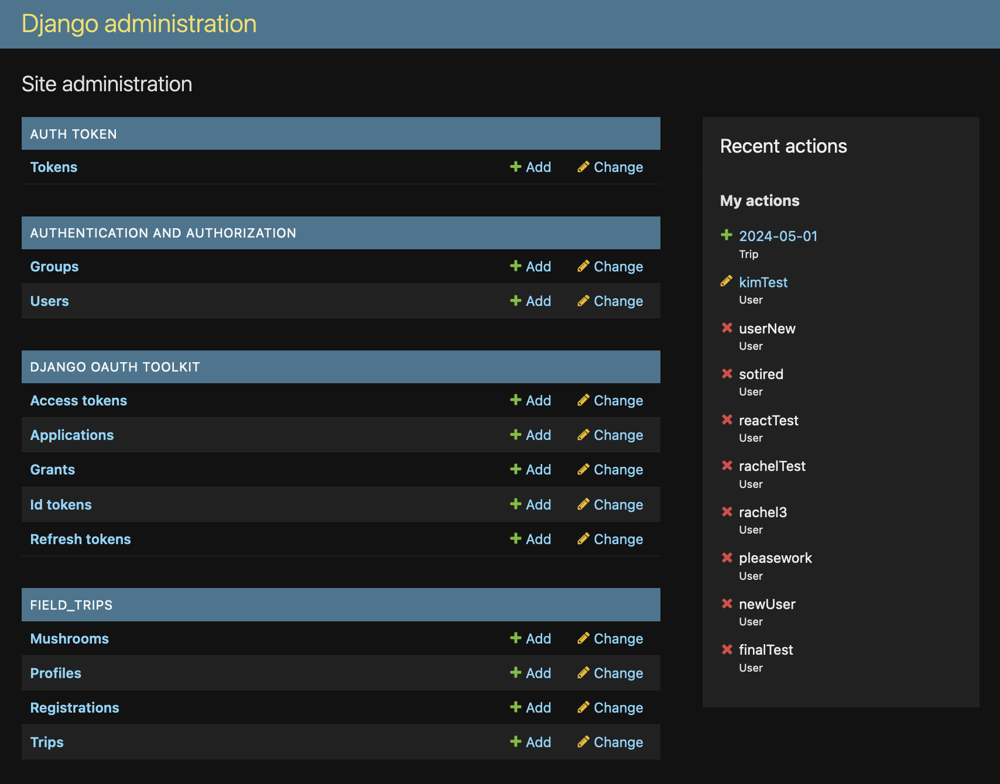
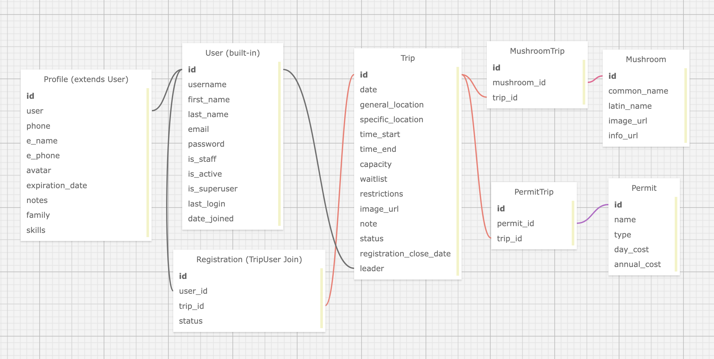

<hr />
<div style="text-align: center">
  <h1> Web API Backend - Myco Matrix</h1>
  <h3>by <a href="https://github.com/kimmykokonut">Kim Robinson</a></h3>
  <p>Initiated April 15, 2024</p>
  
</div>

---

---------------------------
### Jump around!

Return to the [main project README](../README.md) for General information and setup instructions

* <a href="#about-the-project">About the Project</a>
  * <a href="#description">Description</a>
  * <a href="#built-with">Built With</a>
  * <a href="#known-bugs">Known Bugs</a>
* <a href="#api-documentation">API Documention</a>
  * <a href="#using-django-admin">Using Django Admin</a>
  * <a href="#user-authentication-and-authorization">User Authentication and Authorization</a>
  * <a href="#api-endpoints">API Endpoints</a>
* <a href="#license">License</a>

---

### About the Project

### Description

Myco Matrix API allows users to register and sign in to their own account as well as edit their profile information, register for upcoming field trips and access resources such as packing lists and parking and foraging permits needed by location.  Administrators and users within the Coordinator group can create, edit and delete field trips and manually run the lottery, which randomizes registrants and assigns them their trip status (accepted, waitlisted, rejected).  The automated lottery function emails the registrants their status once the lottery is complete and emails the trip leader the group's contact information.  There is also a mushroom model in the database with a many to many relationship with trips, with a stretch goal for users to attach mushrooms seen on specific field trips.  This API utilizes RESTful principles and uses Token Authentication for user authentication and authorization.  Tokens are stored in browser cookies.

### Built With


* Psycopg2
* Python Decouple
* Django CORS Headers
* SMTP Email Backend
* Testing: Django TestCase class

### Known Bugs 
* None known for WebAPI
* Possible bug if there is more than 1 coordinator in database for auto-email, haven't tested


_Please [report](https://github.com/kimmykokonut/Capstone/issues) any issues or bugs_ 

---

### API Documention

Explore the API endpoints in Postman, RestClient or Django Admin

### Using Django Admin

<div style="text-align: center">
  
</div>

Django Admin [Documentation](https://developer.mozilla.org/en-US/docs/Learn/Server-side/Django/Admin_site)

1. The admin.py file is already setup, you need to create a superuser. Navigate to the same directory as manage.py
2. In the terminal: `$python manage.py createsuperuser`  (You will be prompted to enter a username, email address and strong password)
3. Start the development server `$python manage.py runserver`
4. In the browser, open the /admin URL `http://127.0.0.1:8000/admin`, enter your new superuser credentials.
5.  The page you will be brought to displays all the models, which you can explore the data and create, edit or delete records.

---

<div style="text-align: center">
  
  <p>PostgreSQL Database Diagram</p>
</div>

---

### User Authentication and Authorization

In order to be authorized to use `GET`, `POST`, `PATCH`, `DELETE` functionality of the API, you need to be authenticated.  Examples shown are from VS Code extension Rest Client. I keep my endpoint testing in a file named test.rest, where you can test endpoints directly in VS Code.  Your authorization token will be set as a cookie to be embedded in future API calls while your token is valid.

---
`POST` Register
```
###
POST http://127.0.0.1:8000/signup
Content-Type: application/json

{ "username": "tester", "email": "test@email.com", "password": "password", "first_name": "Test", "last_name": "User"
}
```
Sample JSON Response
`201 CREATED`
```
{
  "user": {
    "id": 33,
    "username": "tester",
    "first_name": "Test",
    "last_name": "User",
    "email": "test@email.com"
  }
}
```
---
`POST` Login
```
###
POST http://127.0.0.1:8000/login
Content-Type: application/json

{ "username": "tester", 
  "password": "password" 
}
```
Sample JSON Response
`200 OK`
```
{
  "user": {
    "id": 33,
    "username": "tester",
    "first_name": "Test",
    "last_name": "User",
    "email": "test@email.com"
  }
}
```
---
`POST` Logout (Deletes token)
```
### 
POST http://127.0.0.1:8000/logout
Content-Type: application/json
```
Sample JSON Response
`200 OK`
```
{ "logged out: test@email.com" }
```
---


### API Endpoints

* Pagination is built into mushroom_list (20 results per page) and trip_list (10 results per page)

Base Url: `http://127.0.0.1:8000`

#### HTTP Request Structure

| Method | Endpoint | Description |
| :---: | :---: | :---: |
| | Auth |
| POST | /login | Log in registered user and receive auth token |
| POST | /signup | Register new user |
| POST | /logout | Logs out user by deleting token |
| | Profile |
| GET | /profile | Retrieves user profile of signed in user |
| PUT | /profile | Edit user profile data |
| | Mushrooms |
| GET | /mushrooms | Retrieves list of mushroom objects from database |
| POST | /mushrooms | Create new mushroom object                       |
| | Trips | | 
| GET   | /trips | Retrieves list of trip objects                       |
| POST  | /trips | Create new trip object                               |
| GET   | /trips/:id | Retrieves trip object by id                      |
| PATCH | /trips/:id | Edits trip object                                |
| PUT   | /trips/:id | Edits entire trip object                         |
| DELETE | /trips/:id | Deletes trip object by id                       |
| POST | /trips/:id/register | Signed in user registers for specific field trip, upon registration, status in Registration join table is 'registered' |
| GET | /trips/:id/register | Retrieve registration data for specific trip |
| POST | /trips/:id/lottery | Activate lottery, where registered users are randomized, registration status changed to 'accepted, waitlisted or rejected' and automated emails sent to users with their updated status. Leader is emailed the group of accepted and waitlisted participants. |
| GET | /trips/:id/results | Retrieve results of lottery and registrants by status |
| | User |
| GET | /user/registrations | Retrieve list of trips user is registered for and their status |
| GET | /user/:id | Retrieve user data by id |
| | Permits |
| GET | /permits | Retrieve list of permit objects |
| GET | /permits?ids={id} | Retrieve permit by id number |
| | Leaders |
| GET | /leaders | Retrieve list of users belonging to Leader Group Class |

---

#### Example GET Query

You must be signed in/authenticated to make API calls as the Token at login/signup is used as a cookie to access endpoints.

```
http://127.0.0.1:8000/trips/15
```

#### Sample JSON Response

`200 OK`
```
  {
  "id": 15,
  "date": "2024-05-10",
  "general_location": "Kelly Point State Park",
  "specific_location": "45.64025, -122.76294",
  "time_start": "08:00:00",
  "time_end": "15:00:00",
  "capacity": 4,
  "waitlist": 2,
  "restrictions": "none",
  "image_url": "https://cdn.pixabay.com/photo/2023/10/21/11/23/ai-generated-8331261_1280.png",
  "note": "foraging not allowed, educational foray only",
  "status": "Registration Open",
  "registration_close_date": "2024-05-06",
  "leader": 22,
  "permits": [
    2
  ]
}
```

#### Example Query to create mushroom object
```
POST http://127.0.0.1:8000/mushrooms
Content-Type: application/json

{
  "common_name": "Dyer's Polypore",
  "latin_name": "Phaeolus schweinitzii",
  "image_url": "https://en.wikipedia.org/wiki/Phaeolus_schweinitzii#/media/File:Phaeolus_schweinitzii_02.jpg",
  "info_url": "https://www.inaturalist.org/taxa/118084-Phaeolus-schweinitziiwik"
}
```

#### Sample JSON Response
`201 Created`
```
{
  "id": 22,
  "common_name": "Dyer's Polypore",
  "latin_name": "Phaeolus schweinitzii",
  "image_url": "https://en.wikipedia.org/wiki/Phaeolus_schweinitzii#/media/File:Phaeolus_schweinitzii_02.jpg",
  "info_url": "https://www.inaturalist.org/taxa/118084-Phaeolus-schweinitziiwik"
}
```
#### Example Query to edit trip object
```
PATCH http://127.0.0.1:8000/trips/6
Content-Type: application/json
{
  "general_location": "Mount St Helens National Monument",
  "status": "Closed"
}
```
#### Sample JSON Response
`200 OK`
```
{
  "id": 6,
  "date": "2024-05-15",
  "general_location": "Mount St Helens National Monument",
  "specific_location": "45.9995647, -121.542026",
  "time_start": "09:00:00",
  "time_end": "15:00:00",
  "capacity": 3,
  "waitlist": 2,
  "restrictions": "No dogs, No children",
  "image_url": "https://cdn.pixabay.com/photo/2023/10/21/11/23/ai-generated-8331261_1280.png",
  "note": "Strenuous terrain",
  "status": "Reg Closed",
  "registration_close_date": "2024-05-06",
  "leader": 15,
  "permits": []
}
```

### License

GNU General Public License v3.0, See license.md for more information