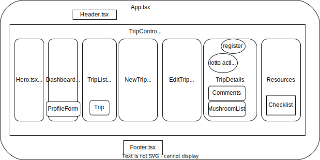

# Project Proposal Template

## Name of Student: Kim Robinson

## Name of Project: 🍄 Fungi Forays 🍄

### Project's Purpose or Goal: (What will it do for users?)
A streamlined-automated approach for registration/lottery/notification.  Registration page for users to sign up for field trips and be notified of their status. Admin roles will have full CRUD access. Coordinator role will have full CRUD for trip creation and notification. Leader roles will be provided a contact list for their specific trip. Members will have read-access only. User data stored for trip contact list.

### List the absolute minimum features the project requires to meet this purpose or goal:
* User authentication
* Resources page with printable packing list, permit info, helpful links
* User can register for field trip and be auto-notified via email of status (chosen/waitlist/not)
* Leader auto-notified of trip participants and contact info
* Admin role has full CRUD, Leader limited, User read only, except in forum can post.
* Automated lottery: on set date, lottery occurs, choosing participants, notifying participants and a trip contact list is created and sent to trip leader.

### What tools, frameworks, libraries, APIs, modules and/or other resources (whatever is specific to your track, and your language) will you use to create this MVP? List them all here. Be specific.
* Planning/Design
  * Miro
  * draw.io
  * SQL designer
* Programming languages: 
  * Typescript/Javascript
  * Python
* Web Framework: Django RESTful api
  * Entity Framework Core
* Frontend Framework: React
  * Vite
  * HTML
  * CSS
  * Material UI
* Database: PostgreSQL for database to store user data, trip info and registrations
* Authentication: Django (user credentials stored in PostgreSQL using Djano ORM)
* Authorization: Django (maybe django-oauth-toolkit library)
* Form handling: (wip) Formik(react)/flask-wtf(python), or built-in via django
* Email Service: smtplib Python library [SMTP service](https://realpython.com/python-send-email/)
* Deployment: (wip) fly.io or render.com
* Version control: Git, GitHub
* Documentation: Swagger

### If you finish developing the minimum viable product (MVP) with time to spare, what will you work on next? Describe these features here: Be specific.
* Weighted lottery (if user has not been on a field trip, their chances improve, if they have been on 2 trips, their chances decrease, if they have signed up 3 times and not chosen, their chances increase)
* Trip report page where users/leaders can upload photos and list species found.
* Weather api on trip page to log weather that day
* Build in mapping component of trip locations (not sure it is worth it? In real life production mode, the gps coord are private)
* Flag banned members and not allow on trips
* A social page where users can connect for carpooling for trips (on trip specific page? or general forum?)
* Add into existing [OMS website](https://www.wildmushrooms.org/) (Site is WordPress, Javascript, jQuery, Html, CSS)
* Data visualization (#people applied per trip, #trips/season, #people on site #leaders..., map bubbles of field trips-bigger bubbles, more trips)
* Mobile-friendly: (React Native?)

### What additional tools, frameworks, libraries, APIs, or other resources will these additional features require?
* API: 
  * [Weather API](https://openweathermap.org/api)
  * [Mapbox](https://docs.mapbox.com/) for trip locations and provide directions
  * [Google Calendar](https://developers.google.com/calendar/api/guides/overview)
  * Push notification: [OneSignal](https://documentation.onesignal.com/reference/create-notification)-send updates to participants
  * [Plant ID Api](https://web.plant.id/plant-identification-api/) unsure if iNaturalist can serve this need.
* Testing: Pytest
* Analytics: Google analytics
* Image storage: Google Cloud
* Flag banned people-in PostgreSQL
* Integration with website-wordpress plugins or custom endpoints for api
* Data visualization: D3.js or Chart.js

### Is there anything else you'd like your instructor to know? 
This may be overly ambitious to learn Python and Django with the time I have but am curious how it performs compared to building a webapi with ASP.NET.  It seems like React + Django has been done before and hopefully my experience with MYSQL will help me transition to PostgreSQL.
I would prefer to make this mobile-friendly but my target audience ranges from 18-70+, so I will aim to keep it a responsive desktop app with accessibility in mind.
---------------------------------------------
### SQL thoughts

* User: Trip (many:many)
* Trip: Mushroom (many:many)
* Leader: Trip (1:many) -will this work if user:trip is already m:m?

* Report: Trip - is the report table necessary? I feel like it's just the same data pulled from Trip + leadername + participants.  Maybe the trip table can hold it all (or is that too complicated?)
### React component thoughts

-unsure if 'activetrips' is it's own component if it just holds dynamic links to active trips to register?
-unsure if stats component is standalone or built into reports/activetrips? dont' want it hidden.
-unsure if forum is a standalone component, as it's not a general forum (though that is a possibility for a stretch goal) i think at this point i want a carpool connect or a way for participants to reach out to each other (vs group email) and be notified of new posts to look for rides, ask q's specific to that trip. but want it private just for that list of people to live with that specific trip. Though I do think I need the trip component embedded into the Report Component so the report can pull some of the trip info plus extra stuff (weather api etc). Unsure if TripReport(for all users to see, and participants to add photos, mushrooms found, etc) is different or same as TripDetails(for participants leading up to the trip)
