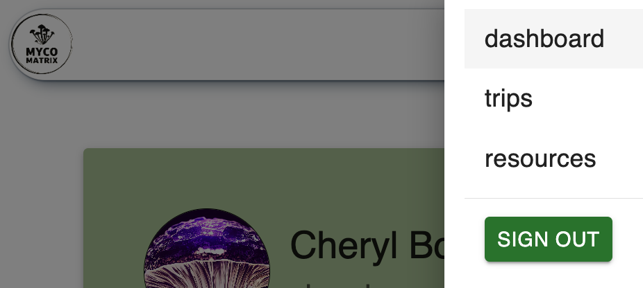

  <h1>Myco Matrix</h1>
  <h3>by <a href="https://github.com/kimmykokonut">Kim Robinson</a></h3>
  
Initiated April 15, 2024

  

---------------------------
### Jump around!
* <a href="#about-the-project">About the Project</a>
  * <a href="#description">Description</a>
  * <a href="#built-with">Built With</a>
  * <a href="../README.md">Known Bugs (Main Readme)</a>
* <a href="#previews-and-documentation">Previews and Documentation</a>
* <a href="./README.md">Getting Started: Prerequisites & Setup (main Readme)</a>
* <a href="/api/README.md">Readme - Backend API Documentation (User authentication, API Endpoints, Django Admin)</a>
* <a href="#miscellaneous">Miscellaneous</a>
  * <a href="#react-component-diagrams">React Component Diagram</a>
  * <a href="#contact-and-support">Contact and Support</a>
  * <a href="#license">License</a>
---------------------------
## About the Project

### Description

  Myco Matrix is an application where users can register for field trip lotteries, connect with other members and access resources to ensure their foraging experience is safe and permitted.

  The Myco Matrix allows users to register and sign in to their own account as well as edit their profile information, register for upcoming field trips and access resources such as packing lists and parking and foraging permits needed by location.  Administrators and users within the Coordinator group can create, edit and delete field trips and manually run the lottery, which randomizes registrants and assigns them their trip status (accepted, waitlisted, rejected).  The automated lottery function emails the registrants their status once the lottery is complete and emails the trip leader the group's contact information.  Stretch goals include incorporating the existing mushroom information in the database to attach mushrooms seen on field trips and have that data visible, as well as a functional comment thread on each field trip, for users to connect with other users.

  This project was inspired by my years spent as the volunteer field trip coordinator for the [Oregon Mycological Society](https://www.wildmushrooms.org/).  I have a strong desire to streamline and automate the process while freeing up volunteer time for other efforts. My long-term goal is to integrate this project into their website to be used for future field trips and provide archival knowledge and encourage more member connection and community.

### Built With
(Front End)
* [React Leaflet](https://react-leaflet.js.org/) 
* [OpenWeather API](https://openweathermap.org/api)

### Previews and Documentation

* Note, styling is using Material UI and is currently in-progress, efforts were focused on back end functionality and front end responsiveness

### Landing Page

If a user is already signed in, they will be redirected to the user dashboard.
Otherwise, they have the option to sign in or register for a new account.  They can not access the rest of the application unless signed in.

### Registration

Once a user registers, they are redirected to the user dashboard. Upon registration and sign in, a token is generated by Django Auth and stored as a browser cookie to access the website that identifies them across pages.

### Header

User can easily navigate to the trip list, resources or to their dashboard.  A signout button is easily accessed from the header so the user can sign out at any time during their session and their authentication token is deleted until they are signed in again.  Header is responsive and on the small screen size, the links become embedded in the hamburger icon, which will open with the list options when clicked.

### User Dashboard

Displays the signed-in user's profile information needed to register for field trips.  They can update their information directly from this page and navigate to the list of field trips.

### Field Trip List

Displays 10 upcoming field trips, sorted by date and clearly marked if registration is open or closed for that trip and any restrictions that may keep user from not applying for said trip.  Details button navigates to the Trip Details page.

### Trip Details Page

The information on the page renders differently depending on the trip status.
If registration is open, user is presented with the trip details, important information, a checkbox to agree to terms and conditions and a registration button.
Admin/Coordinator will have access to the manual run lottery button, edit and delete field trip buttons. (permissions wip)
If registration is closed, the boilerplate information is hidden and the trip comments component (and to come-the mushroom component) where users can post on that trip logistical information like arranging carpools (and adding mushrooms seen to that trip).
Regardless of registration status, user is presented with the trip's basic information, a 5 day weather forecast and a map pinpointing the latitude/longitude that was added when the trip was created.

### Resources

User can access resources in preparation of participating on a field trip.
* Pack it!-a printable checklist of suggested things to bring
* Fires?: an interactive map that is helpful, especially during fire season to know of roads closed or inaccessible areas in the National Forest
* Foraging Permits: Organized by national forest with links where a user can apply for a permit to make sure they are hunting in legal areas
* Mushroom Harvest Maps: Links where users can access forest service maps which have detailed areas of where foraging is allowed/not allowed.
* Parking passes: If a parking permit is needed for a field trip, user can find more information about how to obtain the necessary permits to avoid fines.
* Regulations: Reminders to users about areas that do not permit foraging within Portland, state and federal areas.
* Campgrounds: Notes about campground foraging.

## Miscellaneous

### React Component Diagram

### Contact and Support

If you have any feedback or concerns, 
[Report Bug](https://github.com/kimmykokonut/Capstone/issues)
[Request Feature](https://github.com/kimmykokonut/Capstone/issues)

### License

GNU General Public License v3.0, See license.md for more information